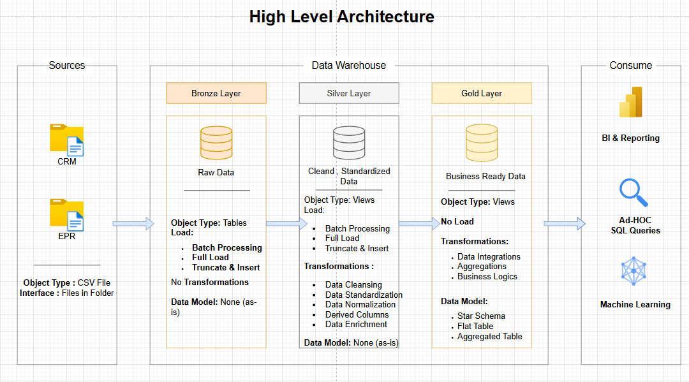
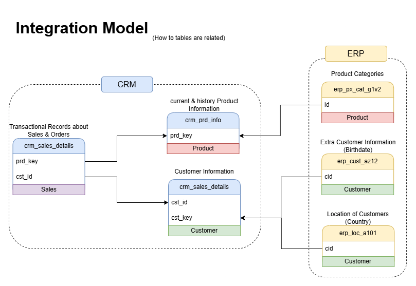
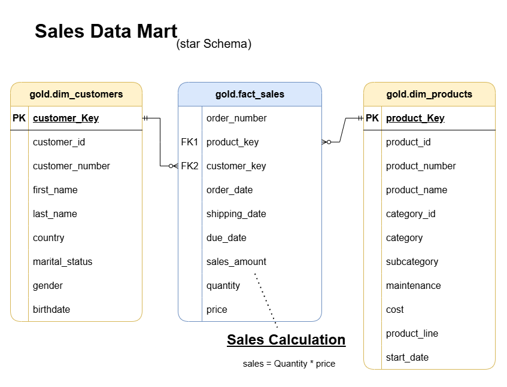

# 🏗️ SQL Data Warehouse Project

> **End-to-end data warehouse project** that builds a scalable ETL pipeline from raw ERP and CRM data to a star-schema data mart for analytics and reporting.

---

## 📌 Project Overview

This project implements a **complete data warehousing solution** using SQL Server. It integrates data from two source systems (**CRM** and **ERP**) and processes it through a structured ETL pipeline to create a clean, standardized, and business-ready data model.

### Business Goals
- Provide a **single source of truth** for sales, product, and customer data
- Support **BI reporting** and dashboards
- Enable **ad-hoc analytical queries**
- Feed **machine learning** models with clean, enriched data

---

## ✅ Project Progress

All project phases have been successfully completed:

<p align="center">
  
</p>

| Phase | Status |
| :--- | :--- |
| Requirements Analysis | ✅ 100% |
| Design Data Architecture | ✅ 100% |
| Project Initialization | ✅ 100% |
| Build Bronze Layer | ✅ 100% |
| Build Silver Layer | ✅ 100% |
| Build Gold Layer | ✅ 100% |

---

## 🏛️ Architecture (Medallion Pattern)

The project follows the **Medallion Architecture** with three layers:

<p align="center">
  
</p>

### 1. Bronze Layer (Raw Data)
- **Type:** Tables
- **Load:** Batch processing (Truncate & Insert)
- **Transformations:** None (data loaded as-is)
- **Purpose:** Raw landing zone preserving original source data

### 2. Silver Layer (Cleaned Data)
- **Type:** Views
- **Load:** Batch processing (Truncate & Insert)
- **Transformations:**
  - Data cleansing & standardization
  - Normalization
  - Derived columns
  - Data enrichment
- **Purpose:** Clean, integrated data ready for business logic

### 3. Gold Layer (Business-Ready)
- **Type:** Views
- **Data Model:** Star Schema (Sales Data Mart)
- **Purpose:** Presentation layer optimized for analytics and BI tools

---

## 🔀 Data Flow & Integration

<p align="center">
  
</p>

### Source Systems

| Source | Tables | Description |
| :--- | :--- | :--- |
| **CRM** | `crm_cust_info` | Customer information |
| | `crm_prd_info` | Product details (current & history) |
| | `crm_sales_details` | Sales transactions |
| **ERP** | `erp_cust_az12` | Customer birthdates |
| | `erp_loc_a101` | Customer locations (country) |
| | `erp_px_cat_g1v2` | Product categories |

### Integration Logic
- **Customers:** Merged from CRM + enriched with birthdate & country from ERP
- **Products:** Merged from CRM + enriched with categories from ERP
- **Sales:** Built from CRM sales, linked to integrated customers and products

<p align="center">
  
</p>

---

## 📊 Data Model (Star Schema)

The Gold layer uses a **Star Schema** optimized for analytical queries:

<p align="center">
  
</p>

### Dimensions

#### `gold.dim_customers`
- `customer_Key` (PK) - Surrogate key
- `customer_id`, `customer_number`
- `first_name`, `last_name`
- `country`, `marital_status`, `gender`, `birthdate`

#### `gold.dim_products`
- `product_Key` (PK) - Surrogate key
- `product_id`, `product_number`, `product_name`
- `category_id`, `category`, `subcategory`
- `maintenance`, `cost`, `product_line`, `start_date`

### Fact Table

#### `gold.fact_sales`
- `order_number` (PK) - Unique order identifier
- `product_key` (FK1) - References `dim_products`
- `customer_key` (FK2) - References `dim_customers`
- `order_date`, `shipping_date`, `due_date`
- `sales_amount`, `quantity`, `price`

> **Sales Calculation:** `Sales Amount = Quantity × Price`

---

## 📂 Repository Structure
```
data-warehouse-project/
│
├── datasets/                           # Raw datasets used for the project (ERP and CRM data)
│
├── docs/                               # Project documentation and architecture details
│   ├── etl.drawio                      # Draw.io file shows all different techniquies and methods of ETL
│   ├── data_architecture.drawio        # Draw.io file shows the project's architecture
│   ├── data_catalog.md                 # Catalog of datasets, including field descriptions and metadata
│   ├── data_flow.drawio                # Draw.io file for the data flow diagram
│   ├── data_models.drawio              # Draw.io file for data models (star schema)
│   ├── naming-conventions.md           # Consistent naming guidelines for tables, columns, and files
│
├── scripts/                            # SQL scripts for ETL and transformations
│   ├── bronze/                         # Scripts for extracting and loading raw data
│   ├── silver/                         # Scripts for cleaning and transforming data
│   ├── gold/                           # Scripts for creating analytical models
│
├── tests/                              # Test scripts and quality files
│
├── README.md                           # Project overview and instructions
├── LICENSE                             # License information for the repository
├── .gitignore                          # Files and directories to be ignored by Git
└── requirements.txt                    # Dependencies and requirements for the project
```
---


---

## 🛠️ Technologies Used

- **SQL Server** - Database engine
- **SQL** - ETL scripting
- **Draw.io** - Architecture and flow diagrams
- **Git** - Version control

---

## 📊 Key Outcomes

✅ **Clean, integrated data** from multiple sources  
✅ **Star schema data mart** for fast analytics  
✅ **Documented ETL process** with clear layers  
✅ **Data quality checks** ensuring integrity  
✅ **Scalable architecture** ready for expansion  

---

## 📝 Notes

- All ETL scripts are idempotent (can be re-run safely)
- Views are used in Silver and Gold layers for logical data modeling
- The project follows consistent naming conventions (see `docs/naming-conventions.md`)
